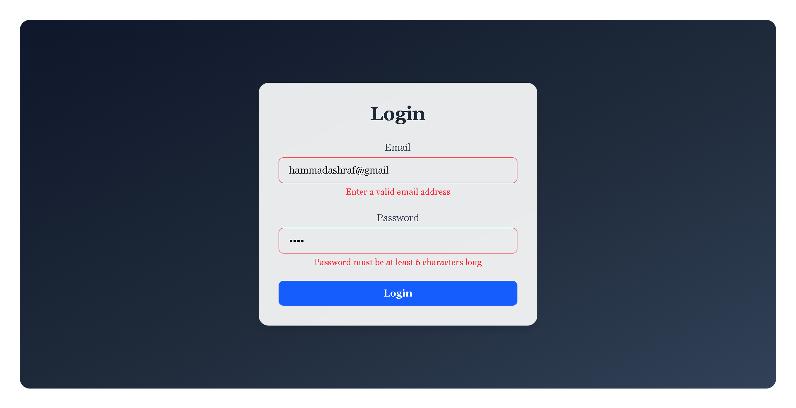

# 🚀 React Login Form with Validation

A modern and responsive **Login Form** built with **React** and **Tailwind CSS**, featuring real-time form validation.  
This project demonstrates how to validate user input (email & password) with error handling and smooth UI feedback.

---

## 📸 Screenshot



---

## ✨ Features

- ✅ Email validation (required & correct format)
- ✅ Password validation (required & min 6 characters)
- ✅ Error messages with dynamic styles
- ✅ Responsive and clean UI with Tailwind CSS
- ✅ Alert on successful login

---

## 🛠️ Tech Stack

- ⚛️ React
- 🎨 Tailwind CSS

---

## 🚀 How to Run Locally

1. Clone the repo
   ```bash
   git clone https://github.com/YOUR_USERNAME/login-form-validation.git
   cd login-form-validation
   ```
